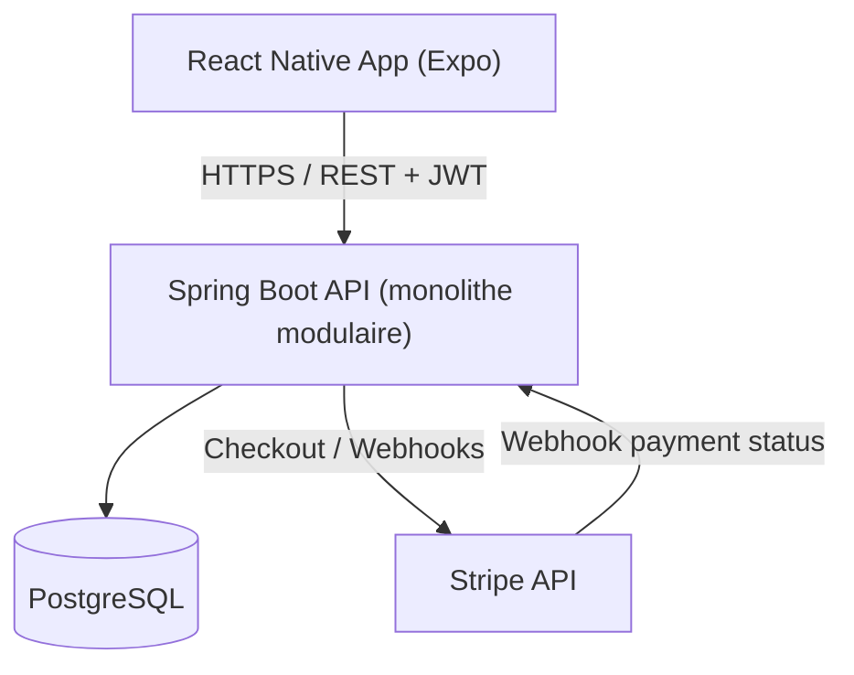
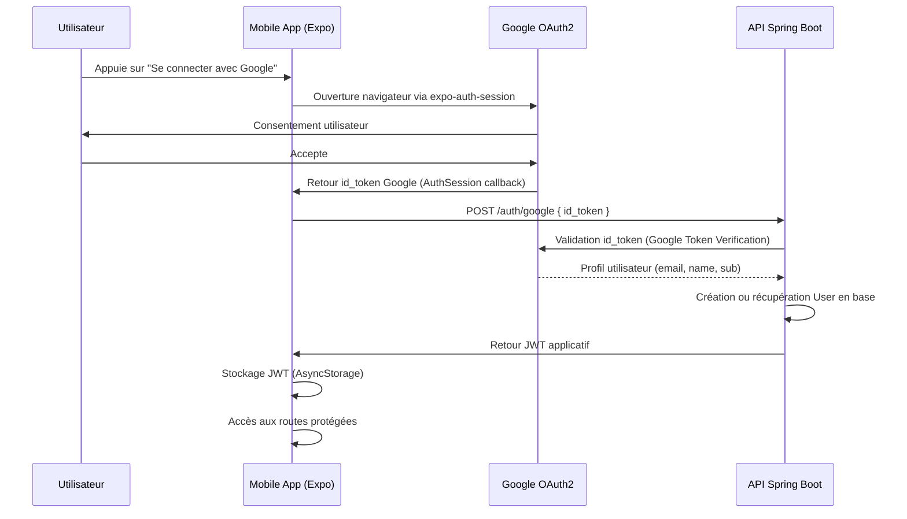
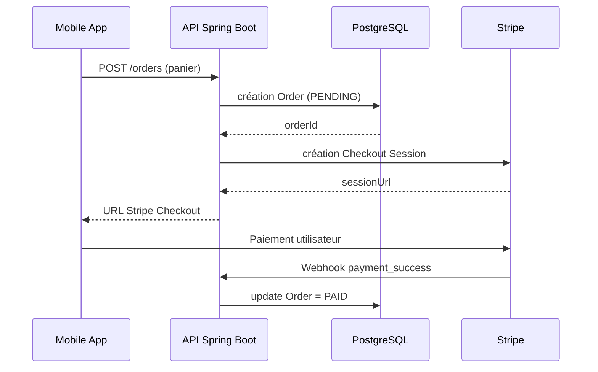
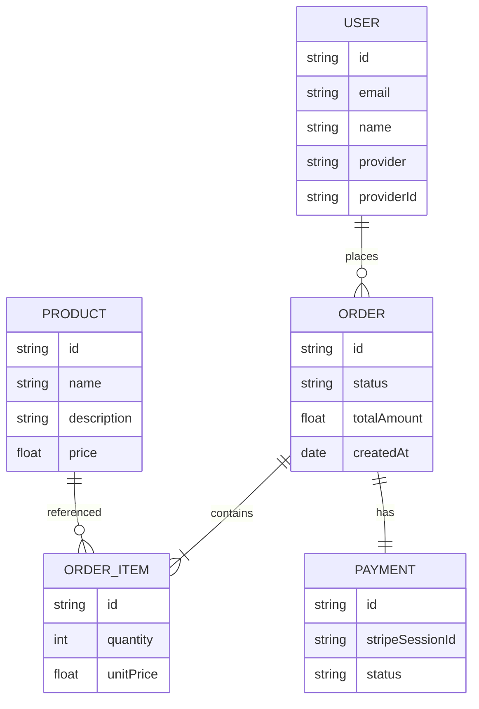
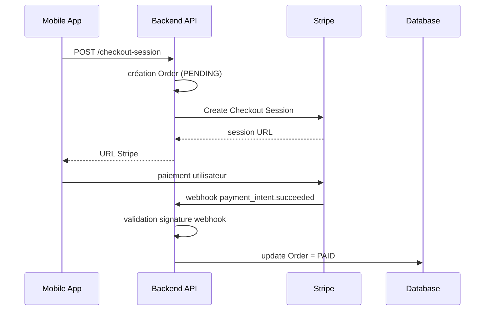
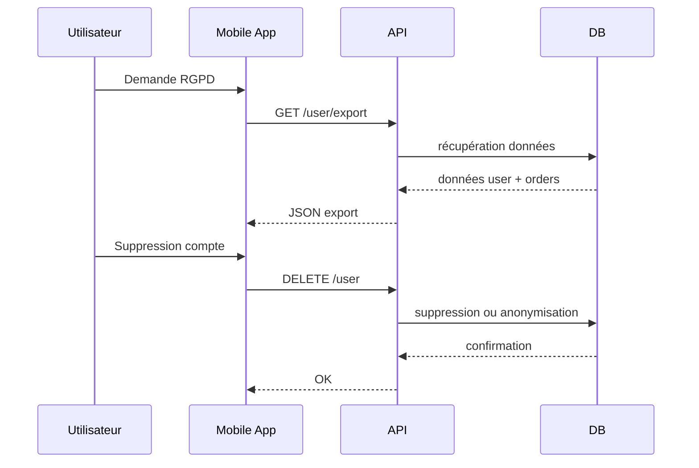

### 1. Diagramme d’architecture globale

---

### 2. Diagramme Authentification (OAuth2 + JWT)

---

### 3. Flow panier → commande → paiement

---

### 4. Modèle de données (ERD simplifié)

---

### 5. Flow Stripe détaillé

---

### 6. Flux RGPD (export / suppression)

